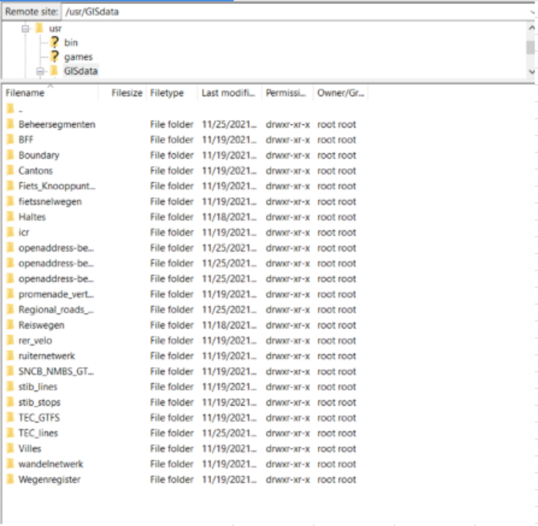

Data
===================

Application takes use of spatial and non spatial data accessed from files and database.

Data Storage
^^^^^
Database
////
Data is stored and served from `Postgresql <https://www.postgresql.org/>`_
Database enabled with **PostGis**.

DB Name: ``uitrit4``

DB Schema: ``uitrit0``

File Storage
////

Data is Stored in GISdata Directory found at ``/usr/GISdata`` on the server.

Structure of Directory:

